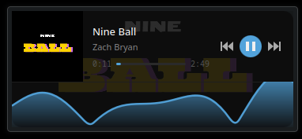

# MediaWave

A KDE Plasma 6 media player widget with a live audio-reactive waveform visualiser.



 

---

## Features

- Album art, track title and artist display
- Clickable progress bar with seek support
- Prev / Play-Pause / Next controls
- Animated waveform that reacts to your music in real time
- Auto-skips to the next song at track end
- Only captures audio from music apps (Elisa, Spotify, VLC, etc.) — never your mic, Discord, or games
- Starts automatically on login via systemd

---

## Requirements

- Fedora Linux (or any distro with KDE Plasma 6)
- PipeWire audio
- Python 3
- `python3-dbus` — `sudo dnf install python3-dbus`
- `numpy` — `pip install numpy --user`
- `pw-record` (included with PipeWire)

---

## Installation

**1. Install Python dependencies**
```bash
sudo dnf install python3-dbus
pip install numpy --user
```

**2. Install the companion daemon**
```bash
mkdir -p ~/.local/share/mediawave
cp mediawave-fft.py ~/.local/share/mediawave/
```

**3. Install the systemd service**
```bash
mkdir -p ~/.config/systemd/user
cp mediawave-fft.service ~/.config/systemd/user/
systemctl --user daemon-reload
systemctl --user enable --now mediawave-fft
```

**4. Install the Plasma widget**
```bash
rm -rf ~/.local/share/plasma/plasmoids/com.github.mediawave
mkdir -p ~/.local/share/plasma/plasmoids/com.github.mediawave/contents/ui
cd /tmp && unzip -o mediawave.plasmoid
cp /tmp/mediawave/contents/ui/main.qml ~/.local/share/plasma/plasmoids/com.github.mediawave/contents/ui/
cp /tmp/mediawave/metadata.json ~/.local/share/plasma/plasmoids/com.github.mediawave/
```

**5. Restart Plasma**
```bash
kquitapp6 plasmashell && kstart plasmashell
```

**6. Add the widget**

Right-click your desktop → Add Widgets → search for **MediaWave** → drag it to your desktop or panel.

---

## File Locations

| File | Location |
|------|----------|
| Companion daemon | `~/.local/share/mediawave/mediawave-fft.py` |
| Systemd service | `~/.config/systemd/user/mediawave-fft.service` |
| Plasma widget | `~/.local/share/plasma/plasmoids/com.github.mediawave/` |

---

## Updating

Re-run steps 2 and 4 with the new files, then:
```bash
systemctl --user restart mediawave-fft
kquitapp6 plasmashell && kstart plasmashell
```

---

## Troubleshooting

**Widget shows "No player"**
```bash
systemctl --user status mediawave-fft
curl http://127.0.0.1:19876/
```

**Waveform not moving**
Make sure Elisa (or another supported music app) is open and playing. The companion only captures audio when a music app stream is detected in PipeWire.

**Service not starting**
```bash
journalctl --user -u mediawave-fft -n 20
```

**Restart the service**
```bash
systemctl --user restart mediawave-fft
```

---

## How It Works

The widget has two parts:

1. **`mediawave-fft.py`** — a Python daemon that runs in the background. It polls the active MPRIS2 player via DBus for track metadata, and uses `pw-record` to capture audio directly from the music app's PipeWire stream. It runs an FFT on the audio to produce 9 frequency band values, then serves everything over a local HTTP server on port 19876.

2. **`main.qml`** — the Plasma widget that polls the HTTP server every 250ms, displays the track info and controls, and draws the waveform canvas using the FFT band data.

---

## Supported Music Apps

Elisa, Spotify, VLC, MPV, Rhythmbox, Strawberry, Audacious, Clementine

---

## License

GPL-2.0-or-later
